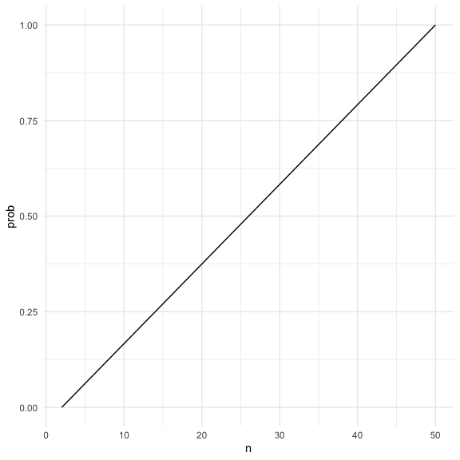

HW 5
================
Shayne Estill (ske2118)

### Problem 1

Suppose you put 𝑛 people in a room, and want to know the probability
that at least two people share a birthday. For simplicity, we’ll assume
there are no leap years (i.e. there are only 365 days) and that
birthdays are uniformly distributed over the year (which is actually not
the case).

Write a function that, for a fixed group size, randomly draws
“birthdays” for each person; checks whether there are duplicate
birthdays in the group; and returns TRUE or FALSE based on the result.

Next, run this function 10000 times for each group size between 2 and
50. For each group size, compute the probability that at least two
people in the group will share a birthday by averaging across the 10000
simulation runs. Make a plot showing the probability as a function of
group size, and comment on your results.

Let’s put people in a room.

``` r
bday_sim = function(n) {

bdays = sample(1:365, size = 10, replace = TRUE)

duplicate = length(unique(bdays)) < n

return(duplicate)

}

bday_sim(10)
```

    ## [1] FALSE

run this a lot

``` r
sim_res = 
  expand_grid(
    n = c(2, 50),
    iter = 1:10000
  ) |>
  mutate(res = map_lgl(n, bday_sim)) |>
  group_by(n) |>
  summarize(prob = mean(res))

sim_res |>
  ggplot(aes(x = n, y = prob)) +
  geom_line()
```



As the group size gets larger, from 2 to 50, the probability that at
least two people in the group will share a birthday by averaging across
the 10000 simulation runs, also increases linearly.

### Problem 2

When designing an experiment or analysis, a common question is whether
it is likely that a true effect will be detected – put differently,
whether a false null hypothesis will be rejected. The probability that a
false null hypothesis is rejected is referred to as power, and it
depends on several factors, including: the sample size; the effect size;
and the error variance. In this problem, you will conduct a simulation
to explore power in a one-sample t-test.

First set the following design elements:

Fix 𝑛=30 Fix 𝜎=5 Set 𝜇=0 . Generate 5000 datasets from the model

𝑥∼𝑁𝑜𝑟𝑚𝑎𝑙\[𝜇,𝜎\]

For each dataset, save 𝜇̂ and the p-value arising from a test of 𝐻:𝜇=0
using 𝛼=0.05 . Hint: to obtain the estimate and p-value, use broom::tidy
to clean the output of t.test.

Repeat the above for 𝜇={1,2,3,4,5,6} , and complete the following:

Make a plot showing the proportion of times the null was rejected (the
power of the test) on the y axis and the true value of 𝜇 on the x axis.
Describe the association between effect size and power. Make a plot
showing the average estimate of 𝜇̂ on the y axis and the true value of 𝜇
on the x axis. Make a second plot (or overlay on the first) the average
estimate of 𝜇̂ only in samples for which the null was rejected on the y
axis and the true value of 𝜇 on the x axis. Is the sample average of 𝜇̂
across tests for which the null is rejected approximately equal to the
true value of 𝜇 ? Why or why not?

``` r
sim_mean_sd = function(n = 30, mu, sigma = 5) {
  
  sim_data = tibble(
    x = rnorm(n, mean = mu, sd = sigma)
  )
  
  sim_data |> 
    summarize(
      mu_hat = mean(x),
      sigma_hat = sd(x)
    )
}
```

Let’s run this to generate 5000 datasets

### Problem 3

The Washington Post has gathered data on homicides in 50 large U.S.
cities and made the data available through a GitHub repository here. You
can read their accompanying article here.

Describe the raw data. Create a city_state variable (e.g. “Baltimore,
MD”) and then summarize within cities to obtain the total number of
homicides and the number of unsolved homicides (those for which the
disposition is “Closed without arrest” or “Open/No arrest”).

``` r
homicide_df = 
  read_csv("./homicide-data.csv") |> 
  janitor::clean_names() 
```

    ## Rows: 52179 Columns: 12
    ## ── Column specification ────────────────────────────────────────────────────────
    ## Delimiter: ","
    ## chr (9): uid, victim_last, victim_first, victim_race, victim_age, victim_sex...
    ## dbl (3): reported_date, lat, lon
    ## 
    ## ℹ Use `spec()` to retrieve the full column specification for this data.
    ## ℹ Specify the column types or set `show_col_types = FALSE` to quiet this message.

The raw data has 52179 rows and 12 columns. It has the reported date as
well as identifying information about the victims and murder location.

``` r
homicide_df_citystate <- homicide_df |>
  mutate(city_state = paste(city, state, sep = ", ")) |>
  group_by(city_state) |>
  summarize(
    total_homicides = n_distinct(uid),
    unsolved_homicides = sum(disposition %in% c("Closed without arrest", "Open/No arrest"))
  )
```

For the city of Baltimore, MD, use the prop.test function to estimate
the proportion of homicides that are unsolved; save the output of
prop.test as an R object, apply the broom::tidy to this object and pull
the estimated proportion and confidence intervals from the resulting
tidy dataframe.

``` r
baltimore_df <- homicide_df_citystate |>
  filter(city_state == "Baltimore, MD")

total_homicides <- baltimore_df$total_homicides
unsolved_homicides <- baltimore_df$unsolved_homicides

prop_test_result <- prop.test(
  x = unsolved_homicides,  
  n = total_homicides,      
  conf.level = 0.95         
)

tidy_result <- broom::tidy(prop_test_result)

estimated_proportion <- tidy_result$estimate
conf_lower <- tidy_result$conf.low
conf_upper <- tidy_result$conf.high

list(
  estimated_proportion = estimated_proportion,
  confidence_interval = c(conf_lower, conf_upper)
)
```

    ## $estimated_proportion
    ##         p 
    ## 0.6455607 
    ## 
    ## $confidence_interval
    ## [1] 0.6275625 0.6631599

Now run prop.test for each of the cities in your dataset, and extract
both the proportion of unsolved homicides and the confidence interval
for each. Do this within a “tidy” pipeline, making use of purrr::map,
purrr::map2, list columns and unnest as necessary to create a tidy
dataframe with estimated proportions and CIs for each city.

``` r
results <- homicide_df_citystate |>
  mutate(
    prop_test = map2(unsolved_homicides, total_homicides, ~ prop.test(x = .x, n = .y, conf.level = 0.95)),
    tidy_result = map(prop_test, broom::tidy) 
  ) %>%
  select(city_state, tidy_result) |>
  unnest(tidy_result)

final_results <- results |>
  select(
    city_state,
    estimated_proportion = estimate, 
    conf_lower = conf.low,           
    conf_upper = conf.high          
  )

print(final_results)
```

    ## # A tibble: 51 × 4
    ##    city_state      estimated_proportion conf_lower conf_upper
    ##    <chr>                          <dbl>      <dbl>      <dbl>
    ##  1 Albuquerque, NM                0.386      0.337      0.438
    ##  2 Atlanta, GA                    0.383      0.353      0.415
    ##  3 Baltimore, MD                  0.646      0.628      0.663
    ##  4 Baton Rouge, LA                0.462      0.414      0.511
    ##  5 Birmingham, AL                 0.434      0.399      0.469
    ##  6 Boston, MA                     0.505      0.465      0.545
    ##  7 Buffalo, NY                    0.612      0.569      0.654
    ##  8 Charlotte, NC                  0.300      0.266      0.336
    ##  9 Chicago, IL                    0.736      0.724      0.747
    ## 10 Cincinnati, OH                 0.445      0.408      0.483
    ## # ℹ 41 more rows

Create a plot that shows the estimates and CIs for each city – check out
geom_errorbar for a way to add error bars based on the upper and lower
limits. Organize cities according to the proportion of unsolved
homicides.
